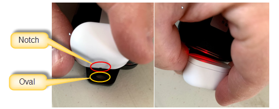
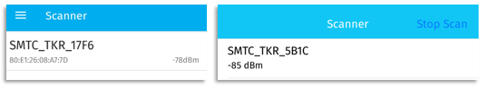

# LoRa Edge Tracker reference design - demonstration application SWSD004

## Description

The LoRa Edge Tracker reference design demonstration application illustrates a full-featured tracker application based on Lora Basics Modem and geolocation middlewares:

- multi-source geolocation (Wi-Fi, GNSS, possibly ToA)
- low-power operation strategy (mobile/static GNSS scan, Wi-Fi backoff, accelerometer-based motion detection)
- BLE and LoRaWAN configurability
- firmware upgrade over BLE (LR1110 and application)
- Almanac update over BLE
- airplane mode
- internal storage for debug purpose
- configuration of the LoRa Basics Modem library;
- concurrent execution of GNSS and Wi-Fi *scan & send or store and forward* features using the
*GNSS geolocation service* and the *Wi-Fi geolocation service*.

### LR1110 Firmware

The applications require that the LR1110 runs the transceiver firmware version 0x0401 or later. To update the LR1110 to the latest firmware version please use the Update modem firmware application included in this project. The latest firmware can be obtained from [another repository](https://github.com/Lora-net/radio_firmware_images/tree/master/lr1110).

Applications usually display the detected LR1110 Firmware version in the serial console when they start.

```
LR11XX FW : 0x0401

INFO: ###### ===== LoRa Basics Modem Tracker application ==== ######

APP VERSION : 3.0.0

INFO: ###### ===== LoRa Basics Modem Version ==== ######
INFO: LoRaWAN version: 01.00.04.01
```

If the LR1110 need to be update, the  applications `main_tracker_update_lr1110.c` updates the LR1110 firmware. The new firmware is received from the UART.

Please read the [application documentation](apps/tracker_application/doc/apps.uart_firmware_update.md) for more details.

## Configuration

### Quick start

This section provides a quick explanation of how to set up the tracker and connect it with the associated mobile application, LoRa Edge™ Config. For additional details, see Set Up the Semtech LoRa Edge™ Tracker Reference Design.

1. Install the LoRa Edge Config on your mobile device. You can download it from Google Play or the App Store.

* Tap I ACCEPT to accept the Software License Agreement.

* In the Almanac URL pop-up window, select the default Almanac URL or advanced users may change to a different URL. The almanac is downloaded automatically.

   * To use the default Almanac URL (https://mgs.loracloud.com) click Later.

   * To change the Almanac URL, click Change Now, and enter the URL of the almanac you wish to use.

* Click Start Scan  (Android) or  (iOS) and allow LoRa Edge Config to access the location of your mobile device.

2. Put your LoRa Edge Tracker Reference Design in Bluetooth Low Energy (BLE) pairing mode by aligning the provided magnet, with the notch side down, against the oval hole on the device. Then place the flat side of the magnet directly against the device, as illustrated in Figure 5. Using the magnet resets the LoRa Edge Tracker Reference Design and starts the BLE pairing.



* When the red LED blinks, the LoRa Edge Tracker Reference Design is in pairing mode. It remains in this mode for 30 seconds.

* In the mobile app, open the Scanner screen. The name of your LoRa Edge Tracker Reference Design is displayed. The last four digits are the DevEUI LSB. This must be the same as the DevEUI printed on the tracker label.



* Tap SMTC_TKR_XXXX to connect the LoRa Edge Tracker Reference Design with the mobile application. Once a connection is established, the red LED is stops blinking and switch in solid. The tracker automatically updates the following, if updates are available:

   * Application firmware
   * LR1110 transceiver firmware
   * GNSS almanac

When the firmware update is complete, the message Tracker up to date displays.

* Once connected, take the following steps, in order:

   * Set your GNSS assistance position.
   * Disable Airplane mode. (LoRa Edge Tracker Reference Designs are shipped in airplane mode).

The tracker operation then starts. You can disconnect the app from the LoRa Edge Tracker Reference Design. To disconnect, click on the left-arrow icon:  (Android),  (iOS).

### Tracker configuration

The application can be configured using 'LoRa Edge™ Config' Android and iOS App running on a compatible smartphone. Communication between the smartphone and the Tracker application uses the Bluetooth Low Energy (BLE) wireless technology. The Tracker application starts advertising at startup and then whenever it detects the presence of a magnet. It stops advertising after 30 seconds when not paired. The timeout value is configured by the `TRACKER_ADV_TIMEOUT_MS` constant.

The tracker can be configure also by LoRaWAN downlink.

The following parameters can be configured :

| Parameter                              | BLE                | LoRaWAN            |
| -------------------------------------- | ------------------ |------------------- |
| `LoRaWAN Device EUI`                   | :heavy_check_mark: | :x:                |
| `LoRaWAN Join EUI`                     | :heavy_check_mark: | :x:                |
| `LoRaWAN Application Key`              | :heavy_check_mark: | :x:                |
| `Use Semtech Join Server mode`         | :heavy_check_mark: | :x:                |
| `Update almanac`                       | :heavy_check_mark: | :x:                |
| `GNSS constellation`                   | :heavy_check_mark: | :heavy_check_mark: |
| `GNSS antenna`                         | :heavy_check_mark: | :heavy_check_mark: |
| `Airplane mode`                        | :heavy_check_mark: | :x:                |
| `Use accelerometer`                    | :heavy_check_mark: | :heavy_check_mark: |
| `Scan interval when tracker is moving` | :heavy_check_mark: | :heavy_check_mark: |
| `Scan interval when tracker is static` | :heavy_check_mark: | :heavy_check_mark: |
| `Reset accumulative charge`            | :heavy_check_mark: | :heavy_check_mark: |
| `Reset board`                          | :heavy_check_mark: | :heavy_check_mark: |

### LoRaWAN Commissionning Configuration

The `apps/common/lorawan_key_config.h` header file defines several constants to
configure the LoRaWAN parameters (region, keys).

| Constant         | Comments                         |     
| ---------------- | -------------------------------- |
| `LORAWAN_REGION` | Selects the regulatory region    |
| `LORAWAN_CLASS`  | Selects the LoRaWAN class to use |

Supported values for `LORAWAN_REGION`:

* `SMTC_MODEM_REGION_EU_868 (default)`
* `SMTC_MODEM_REGION_US_915`
* `SMTC_MODEM_REGION_AS_923_GRP1`
* `SMTC_MODEM_REGION_AU_915`
* `SMTC_MODEM_REGION_CN_470`
* `SMTC_MODEM_REGION_AS_923_GRP2`
* `SMTC_MODEM_REGION_AS_923_GRP3`
* `SMTC_MODEM_REGION_IN_865`
* `SMTC_MODEM_REGION_KR_920`
* `SMTC_MODEM_REGION_RU_864`

Supported values for `LORAWAN_CLASS`:

* `SMTC_MODEM_CLASS_A`

### Join configuration

The LR1110 is pre-provisioned with a ChipEUI/DevEUI and a JoinEUI. The application will use these identifiers because the code is compiled with the flag `CRYPTO=LR11XX_WITH_CREDENTIALS` and the parameter `Use Semtech Join Server mode` is set to true by default.

## Build

To build the example application for the STM32WB55 controller of the Tracker board, you will need:

* GNU Arm Embedded Toolchain (https://developer.arm.com/tools-and-software/open-source-software/developer-tools/gnu-toolchain/gnu-rm/downloads)

The demo needs to be programmed with two binaries :
- The bootloader dedicated for the Firmware upgrade Over The Air (FOTA) : `BLE_Ota.bin`
- the application : `tracker_application_autonomous.bin`

### Building with the GNU Arm Embedded Toolchain

The demo can be built through GNU make command by doing the following:

```shell
# Navigate to the build folder
$ cd apps/tracker_application/makefile

# Execute the make call
$ make -j
```
#### Programming

The bootloader `BLE_Ota.bin` is mandatory to run the tracker application, the binary of the bootloader is located in `apps/tracker_application/bin` folder, 
it has to be programmed at the 0x08000000 address.

For instance ( with STM32_Programmer_CLI ):
```
./STM32_Programmer_CLI.exe -c port=SWD -w "PATH\SWSD004\apps\tracker_application\bin\BLE_Ota.bin" 0x08000000
```
on linux
```
./STM32_Programmer_CLI -c port=SWD -w PATH//SWSD004/apps/tracker_application/bin/BLE_Ota.bin 0x08000000
```

The application `tracker_application_autonomous.bin` is located in `apps/tracker_application/makefile/build` folder, 
it has to be programmed at the 0x08007000 address

for instance ( with STM32_Programmer_CLI ):
on windows :
```
./STM32_Programmer_CLI.exe -c port=SWD -w "PATH\SWSD004\apps\tracker_application\bin\tracker_application_autonomous.bin" 0x08007000

./STM32_Programmer_CLI.exe -c port=SWD -w "PATH\SWSD004\apps\tracker_application\makefile\build\tracker_application_autonomous.bin" 0x08007000
```
on linux
```
./STM32_Programmer_CLI -c port=SWD -w PATH//SWSD004/apps/tracker_application/bin/tracker_application_autonomous.bin 0x08007000

./STM32_Programmer_CLI -c port=SWD -w PATH//SWSD004/apps/tracker_application/makefile/build/tracker_application_autonomous.bin 0x08007000
```

**Note:** 
By default, the demonstration is compiled to use the LR1110 pre-provisioned ChipEUI/DevEUI and JoinEUI.
The supported application names are `tracker_application_autonomous`, `uart_firmware_update`.

### Memory Flash sector mapping

Here the flash sector mapping of the demonstration

| Sector                       | Context type                       |
| ---------------------------- | ---------------------------------- |
| 1 to 6                       | Bootloader                         |
| 7 to application flash end   | Tracker application                |
| application flash end to 194 | Internal log                       |
| 164                          | ADDR_FLASH_STORE_AND_FORWARD       |
| sector flash end to 193      | Store and forward                  |
| 194                          | FLASH_USER_INTERNAL_LOG_CONTEXT    |
| 195                          | ADDR_FLASH_MODEM_KEY_CONTEXT       |
| 196                          | FLASH_USER_TRACKER_CONTEXT         |
| 197                          | ADDR_FLASH_SECURE_ELEMENT_CONTEXT  |
| 198                          | ADDR_FLASH_DEVNONCE_CONTEXT        |
| 199                          | ADDR_FLASH_LORAWAN_CONTEXT         |
| 200                          | ADDR_FLASH_MODEM_CONTEXT           |
| 201                          | Not Used                           |
| 202                          | FLASH_USER_MODEM_E_TRACKER_CONTEXT |

To erase sector(s):

```
./STM32_Programmer_CLI.exe -c port=SWD -e [n m] 
```

for instance to erase complete application + associated contexts :
```
./STM32_Programmer_CLI.exe -c port=SWD -e [8 202] 
```

## Usage

### Serial console

The application requires no user intervention after the static configuration
option have been set.

Use a terminal application configured with the following settings:

Speed: 921600 baud
Data bits: 8s
Stop bits: 1
Parity: None

Information messages are displayed on the serial console, starting with the
DevEUI, AppEUI/JoinEUI and PIN that you might need in order to register your
device with the LoRa Cloud Device Join service.

### LoRaWAN Network Server / Application Server

This application needs an Application Server to run in order to perform the GNSS and Wi-Fi
solving.
* Use the LoRaCloud Locator https://locator.loracloud.com/ which embed a complete integration of an application server and an associated dashboard. 

### ADR configuration

The Adaptive Data Rate (ADR) is configured in *Custom ADR profile* with datarate
distribution and number of repetition defined per regions.

The actual datarate and number of retransmission values are defined in the
`main_tracker_application_autonomous.c` file.

The values must be carefully set to match with duty cycle constraints, power
consumption targets etc...

## Expected Behavior

Here follow the steps that shall be seen in the logs to indicate the expected behavior of the application.

By default, the device should send a position every two minutes whatever the selected region.

### Device starts and resets

```
INFO: Modem Initialization

###### ===== LoRa Basics Modem Tracker application ==== ######
```

Following this print you shall find application and parameter prints

### Joined the network

At first run no time is supposed to be available

```
INFO: ###### ===== JOINED EVENT ==== ######
```

### Execute and send the assisted multiframe GNSS scan

```
New scan group for assisted scan
INFO: RP_TASK_GNSS - new scan group - task queued at 461083 + 120000
---- internal scan start ----
---- internal scan start ----
INFO: ###### ===== MIDDLEWARE_1 EVENT ==== ######
INFO: GNSS middleware event - SCAN DONE
SCAN_DONE info:
-- token: 0x07
-- is_valid: 1
-- number of valid scans: 4
-- scan[0][1335796859] (10 SV): 8247EA010A01567378AFF1C58A85C9DAAC54199BD49A4C2245D6E833409C1A89B0020B00
   SV_ID 26:	46dB
   SV_ID 7:	    45dB
   SV_ID 15:	43dB
   SV_ID 6:	    42dB
   SV_ID 9:	    42dB
   SV_ID 89:	42dB
   SV_ID 20:	40dB
   SV_ID 99:	39dB
   SV_ID 92:	38dB
   SV_ID 108:	37dB
-- scan[1][1335796883] (10 SV): 8249EA010A01567338BBF07532486A9F4CD31D5CD41D3D2205571672D2625627B2CDCD0D
   SV_ID 26:	46dB
   SV_ID 7:	    46dB
   SV_ID 15:	44dB
   SV_ID 92:	43dB
   SV_ID 9:	    42dB
   SV_ID 89:	42dB
   SV_ID 98:	41dB
   SV_ID 6:	    41dB
   SV_ID 108:	41dB
   SV_ID 20:	40dB
-- power consumption: 16 uah
-- mode: 1
-- assisted: 1
-- aiding position: (45.131836, 5.888672)
-- almanac CRC: 0X6A820509

# (...Several TX...)

---- internal TX DONE ----
INFO: ###### ===== MIDDLEWARE_1 EVENT ==== ######
INFO: GNSS middleware event - TERMINATED
TERMINATED info:
-- number of scans sent: 2
```

### Execute and send the Wi-Fi scan

```
INFO: RP_TASK_WIFI - new scan - task queued at 40097 + 30000
---- internal Wi-Fi scan start ----
INFO: start Wi-Fi scan
WARN: No time available.

INFO: ###### ===== MIDDLEWARE_2 EVENT ==== ######
INFO: Wi-Fi middleware event - SCAN DONE
SCAN_DONE info:
-- number of results: 3
-- power consumption: 0 uah
-- Timestamp: 0
64 70 02 D9 94 55  -- Channel: 1 -- Type: 1 -- RSSI: -78
3C 17 10 B7 CD 90  -- Channel: 6 -- Type: 1 -- RSSI: -88
74 B6 B6 42 B4 EB  -- Channel: 1 -- Type: 2 -- RSSI: -87

---- internal TX DONE ----
INFO: ###### ===== MIDDLEWARE_2 EVENT ==== ######
INFO: Wi-Fi middleware event - TERMINATED
TERMINATED info:
-- number of scans sent: 1
```

### Receive a configuration downlink

```
INFO: ###### ===== DOWNLINK EVENT ==== ######
Rx window: 2
Rx port: 151
Rx RSSI: -66
Rx SNR: 11
INFO: Downlink received:
INFO:   - LoRaWAN Fport = 151
INFO:   - Payload size  = 7
INFO:   - RSSI          = -66 dBm
INFO:   - SNR           = 11 dB
INFO:   - Rx window     = SMTC_MODEM_EVENT_DOWNDATA_WINDOW_RX2
Payload - (6 bytes):
 4C 05 01 26 01 00 77
INFO: ###### ===== TRACKER CONFIGURATION SETTINGS PAYLOAD RECEIVED ==== ######

tx_max_payload 242
 - Tracker settings (7 bytes) : Send data
```

## Miscellaneous

### Airplane Mode

The initial default configuration puts the Tracker device in airplane mode. In this mode, the device does not automatically join the LoRaWAN network. The Hall sensor effect is also only enabled for a short period of time each time the tracker detect a motion. The device can be taken out of the airplane mode using the LoRa Edge™ Config application.

When the batteries are depleted, the device is automatically put back in airplane mode.

### Hall effect sensor

The Hall effect sensor is used as a switch to start BLE advertising. It is activated when the user puts a magnet nearby. In airplane mode, the Hall effect sensor is only active at startup and during a 60-second interval when the tracker detects a motion. The activation duration is configured by the `TRACKER_HALL_TIMEOUT_MS` constant.

:exclamation: When the hall effect sensor detects a shield, it resets the tracker to start the BLE. the BLE doesn't run in parallel of LoRa Basics Modem
| ------------------------------------------------------------------------------------------------------------------------------------------------------ |

### LEDs

There is a bi-color LED on the LoRa Edge Tracker Reference Design board:

The yellow component is then called the RX LED and the red component is the TX LED. 

The application uses the LED of the Lora Edge Tracker Reference Design to display the following events:

* Application startup: the LEDs blink twice with a 100 ms period.
* Battery depleted: the LEDs blink five times within a 500 ms period.
* BLE radio connection mode advertising: the TX LED toggle every 100 ms.
* BLE radio connection mode activity: the TX LED blinks continuously.
* Hall effect sensor interrupt: the RX LED is turned on. The LED is turned off when the interrupt is acknowledged.
* Middlewares and sensors frame sent: the TX LED flashes once during 100ms. The duration of the event can be configured with the `LED_PERIOD_MS` constant.
* Downlink frame received: the RX LED flashes once during 100ms. The duration of the event can be configured with the `LED_PERIOD_MS` constant.

## Known Limitation

### Firmware

- The BLE stack doesn't run in parallel of LoRa Basics Modem, the BLE thread runs only at the init of the tracker, once the application leaves the BLE thread and starts the main application it can't return in BLE thread.

### LoRa Edge Config

- Please refer to the [the Wiki](https://github.com/Lora-net/SWSD004/wiki/LoRa-Edge-Config)