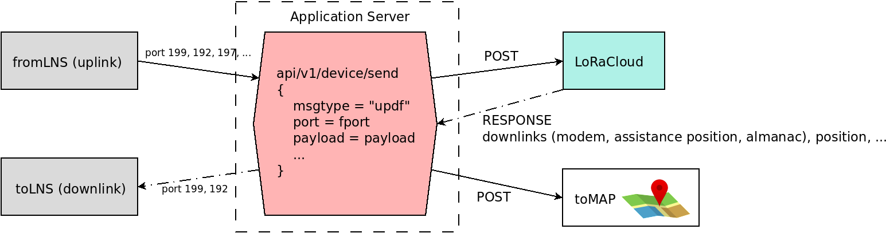

Application server for Geolocation
==================================

.. _Application Server Introduction:

Introduction
------------

The geolocation middleware presented in this project implements protocols supported by LoRaCloud "Modem and Geolocation Services", in order to simplify the integration at the application server side.

In order to get the end-to-end system running, the application server just needs to forward any uplink coming from the LNS (LoRaWAN Network Server) in an "updf" message to LoRaCloud API, and forward back any downlink request from LoRaCloud to the LNS.

At the minimum, the following ports need to be forwarded (uplink/downlink):

* port 199 (default modem port): for modem services required by the GNSS middleware (time synchronization and almanac update).
* port 192 (default gnssng port): for GNSS NAV-Group protocol solving.
* port 197 (default wifi port): for Wi-Fi solving.

The format of the "updf" message type is described here:

https://www.loracloud.com/documentation/modem_services?url=mdmsvc.html#uplink-message

All the uplinks received can be pushed to the "/api/v1/device/send" LoRaCloud API, with the JSON payload formatted like this:

.. code-block:: json
   {
      "deveui": deveui_,
      "uplink": {
            "msgtype": "updf",
            "fcnt": fcnt,
            "port": port,
            "payload": payload,
            "gnss_assist_position": network_position
      }
   }

While the `gnss_assist_position` is optional, it is recommended to pass the coordinates given with an uplink by the Network Server, when this position is trusted to be correct. It will be used by LoRaCloud as a hint for assistance position when required.

Application Server block diagram
--------------------------------

This diagram is a view of an implementation of an application server.

.. _fig_docApplicationServerBlockDiagram:

