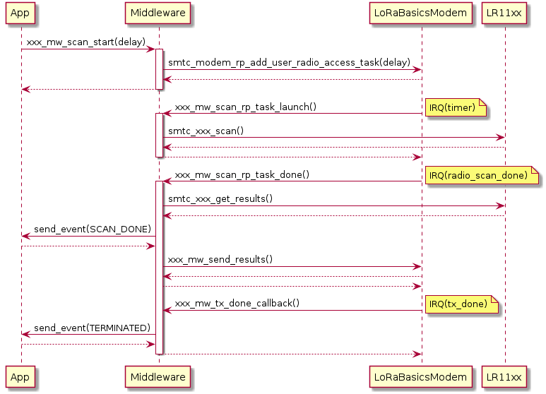
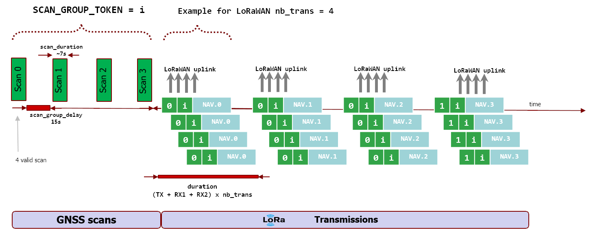
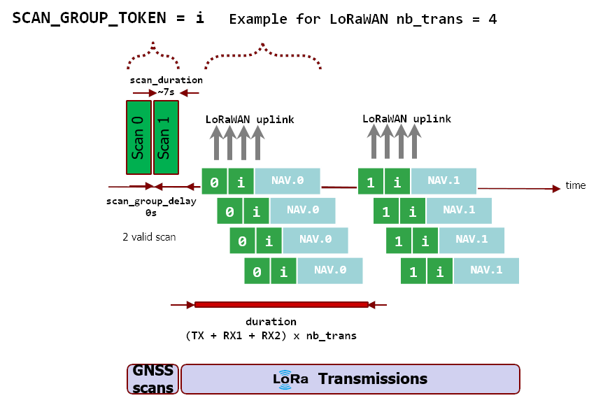
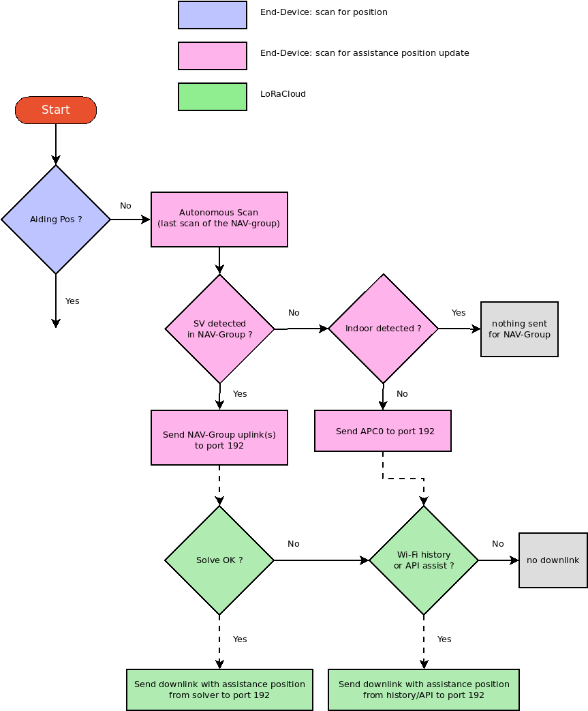
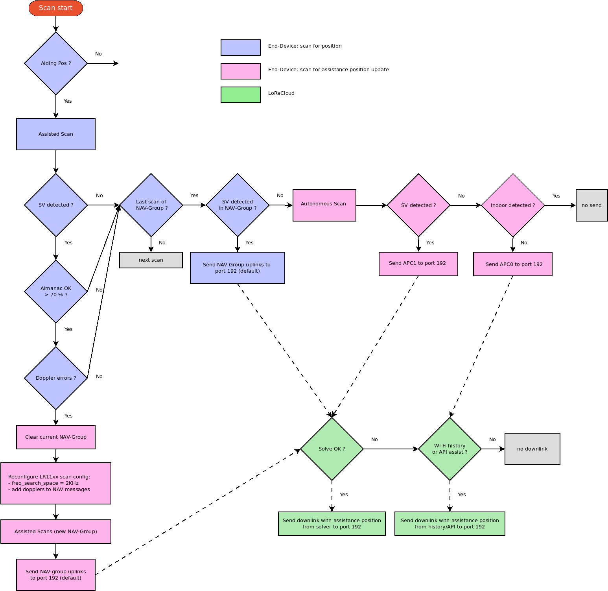

Geolocation middlewares
=======================

.. _Middleware Introduction:

Introduction
------------

The geolocation middleware aims to provide a high level API to run "scan & send" sequences, as simply as possible.

It implements the protocols specified by LoRaCloud "Modem and Geolocation Services" in order to simplify end-to-end integration.

The particular protocols involved are:

* the `Modem` protocol for time synchronization and almanac update.
* the `GNSS Nav-Group (GNSS-NG)` protocol for GNSS scanning with best accuracy positioning and automatic aiding position update.
* the `LoRa Edge Wi-Fi positioning` protocol for Wi-Fi scanning.

The middleware provides an abstraction layer:

* on top of the LR11xx radio for geolocation features (GNSS & Wi-Fi scanning)
* based upon the LoRa Basics Modem for scheduling operations and sending results over LoRaWAN.

The goal is to expose as few parameters as possible to the user application, to accomplish pre-defined modes of operation (static device, mobile device, ...) with the best performances.

The user application just has to program when the next scan needs to be launched. The middleware will notify when the operation has completed with events.

.. _fig_docMiddlewareSequenceOverview:

   middleware scan & send sequence overview

.. _GNSS Middleware:

GNSS middleware
---------------

The GNSS middleware implements the `LoRa Edge GNSS-NG (NAV-Group) positioning protocol <https://www.loracloud.com/documentation/modem_services?url=mdmsvc.html#lora-edge-gnss-ng-nav-group-positioning-protocol>`_ specified by LoRaCloud.

.. _GNSS scan group:

Scan group (GNSS Nav-Group)
+++++++++++++++++++++++++++

In order to get the best accuracy from GNSS scan results, it is recommended to use the **multiframe** feature of the solver.

In this context, a scan group is a group of scan results (NAV messages) to be used together to solve a position.

A scan group also has an identifier (a token) used to identify the NAV messages which have to be grouped together for multiframe solving.

A scan group can be *valid* if there is enough scans within the group that meet the expected criteria (minimum number of Space Vehicles detected...).
So it can also be *invalid*, in this case the results will not be sent over the air by the middleware.

.. _GNSS scanning modes:

Scanning modes
++++++++++++++

Currently there are 2 modes supported, but this could be extended in the future.

* **STATIC mode**: to be used for non-moving objects
* **MOBILE mode**: to be used for mobile objects

Selecting a particular mode will indicate to the middleware how operations must be sequenced to get the best performances.

    **STATIC mode**

    When this mode is selected, with ``GNSS_MW_MODE_STATIC``, the GNSS middleware will run 4 GNSS scans, with a delay of 15 seconds between the end of a scan and the start of the next one.
    Once the last scan is completed, it will send each scan result within a LoRaWAN uplink, one after the other. The full scheme is shown on figure `fig_geoloc_staticScanScheme`_

    **MOBILE mode**

    When this mode is selected, with ``GNSS_MW_MODE_MOBILE``, the GNSS middleware will run 2 GNSS scans, with no delay between the end of a scan and the start of the next one.
    Once the last scan is completed, it will send each scan result within a LoRaWAN uplink, one after the other. The full scheme is shown on figure `fig_geoloc_mobileScanScheme`_

.. _fig_geoloc_staticScanScheme:

   Illustration of *STATIC mode* showing the scan sequence and transmission over LoRaWAN

.. _fig_geoloc_mobileScanScheme:

   Illustration of *MOBILE mode* showing the scan sequence and transmission over LoRaWAN

.. _GNSS events notification:

Events notification
+++++++++++++++++++

In order to inform the user application about the "scan & send" sequence status, the middleware send several events to indicate what happened and allow the user application to take actions.

* **SCAN_DONE**: This event is always sent, at the end of the scan sequence (before sending results over the air). It is also sent if the scan group has been aborted, and set to invalid. This event also indicates to the user application if it has to trig an almanac update modem device management uplink.
* **TERMINATED**: This event is always sent, at the end of the send sequence (even if nothing has been sent). It indicates the number of uplinks that have been sent, if an aiding position check message has been sent, and if it has detected that the device is indoor or not.
* **CANCELLED**: Sent when the middleware acknowledges a user cancel request.
* **ERROR_ALMANAC**: Sent when a scan could not be done due to an ALMANAC being too old.
* **ERROR_NO_TIME**: Sent when a scan could not be done due to no valid time available (clock sync).
* **ERROR_NO_AIDING_POSITION**: Sent when a scan could not be done due to no assistance position configured.
* **ERROR_UNKNOWN**: An unknown error occurred during the sequence.

When data associated with an event are available, a dedicated API function to retrieve those data is provided. It is the case for SCAN DONE event and TERMINATED event:

* ``gnss_mw_get_event_data_scan_done()``
* ``gnss_mw_get_event_data_terminated()``

Once the application has retrieved pending events and handled it, it must call the ``gnss_mw_clear_pending_events()`` API function.

.. _GNSS internal choices:

Internal choices
++++++++++++++++

In order to reach an acceptable trade-off for performances, power consumption and simplicity, some parameters have been set in the middleware, and are not configurable from the API.

* A maximum of 10 Space Vehicles detected per NAV message: allow good accuracy while still being able to transmit a complete NAV message in 1 uplink (49 bytes when dopplers are enabled).
* LR1110 scan parameters: dopplers are always enabled in NAV messages, to maximize the chances to to get an assistance position update from LoRaCloud, using the doppler solver.
* A scan group is valid as soon as there is a valid scan in the group (with a valid NAV message).

Some clarification about what is a valid scan group, a valid scan or a valid NAV message:

* *scan group*: a scan group is valid if the result of the function `gnss_scan_group_queue_is_valid()` is true.
* *scan*: a scan is valid if the LR11xx radio returned more than 0 detected space vehicles.
* *NAV message*: a NAV message is valid if the result of the function `smtc_gnss_is_nav_message_valid()` is true, which depends on the number of SV detected per constellation.

For example a scan group is:

* *not valid* if there was only one valid scan with an invalid NAV message.
* *valid* if there were 2 valid scans, even if the individual NAV messages would be invalid (no check on individual NAV validity for multiframe solving).

.. _GNSS default options:

Default options
+++++++++++++++

We have made the choice to keep configuration parameters as low as possible for a standard usage of the middleware.

By default:

* The GNSS constellations used are: **GPS & BEIDOU**
* Each scan results is sent as a dedicated LoRaWAN uplink on **port 192**.
* The scan group token is incremented by 1 for each valid scan group.

.. _GNSS advanced options:

Advanced options
++++++++++++++++

Some default parameters can be overruled for specific use cases:

* The constellations to be used: use GPS only, BEIDOU only
* The port on which the LoRaWAN uplink is sent. WARNING: it should be changed accordingly on LoRaCloud side to keep integration functional.
* The sequence can be set as "send_bypass" mode, meaning that the scan results won't be automatically sent by the middleware. It can be useful if the user application wants to send the result in a specific manner (using modem streaming feature...).
* Several scan groups can be aggregated together by keeping the same token. It can be useful for non-mobile objects for multiframe solving with a sliding window.

.. _Internals of the GNSS middleware:

Internals of the GNSS middleware
++++++++++++++++++++++++++++++++

The main role of the middleware is to ease the usage of the LR11xx radio and avoid conflicts between the radio usage for GNSS scanning and other concurrent tasks in an application (transmitting packets...).

For this, the middleware heavily relies on `LoRa Basics Modem` (LBM) and in particular its `Radio Planner`.

In LBM, the Radio Planner is responsible for arbitrating the radio usage and ensure that only one user tries to access it at a time.

* So, when the user calls the ``gnss_mw_scan_start()`` function to start a GNSS scan in the specified delay, it basically schedules a new task in the Radio Planner. The task is scheduled with the ASAP mode, this means that if the radio is already busy at the requested time, the task will be shifted and executed As Soon As Possible.
* When the Radio Planner is ready to launch the programmed task, the ``gnss_mw_scan_rp_task_launch()`` function is called, and the LR11xx radio is ready to be configured to perform the first scan of the scan group. **It is important to note that the code is executed under interrupt, so it needs to be as quick to execute as possible.**
* Once the LR11xx radio has completed the scan, the Radio Planner will call the ``gnss_mw_scan_rp_task_done()`` function of the middleware. **Again, this function is executed under interrupt context, so needs to be fast.** This function will get the scan results and store it in the scan group queue. It will also send a ``GNSS_MW_EVENT_SCAN_DONE`` event to the application. The user application can retrieve scan results and statistics by calling the ``gnss_mw_get_event_data_scan_done()`` function.
* Then, either it is the last scan of the group and it will trigger the first transmission, or it is not the last and it will program the next scan of the queue.
* For sending results over the air, the middleware uses an extended internal API of the LBM which does not copy the buffer to be sent, so the middleware must ensure that the buffer to be sent keeps consistent until it is sent. The LBM will call the ``gnss_mw_tx_done_callback()`` for each completed transmission, and based on this, the middleware will pop from the queue all results to be sent over the air.
* Once the last scan result of the scan group has been sent, the ``GNSS_MW_EVENT_TERMINATED`` event is sent to the application, and the scan sequence is over.

.. _Prerequisites for a GNSS scan:

Prerequisites for a GNSS scan
+++++++++++++++++++++++++++++

There are some prerequisites necessary to have a functional GNSS scan, and to get the best performances. It is the responsibility of the user application to ensure that those requirements are met.

* **time**: a valid time must be provided (ALC Sync, network clock sync...). The Modem clock sync feature from LBM is used.
* **almanac**: the Almanac written in the LR11xx flash memory must be as up-to-date as possible. It can either be be fully updated at once, or incrementally updated through LoRaCloud Modem & Geolocation Services. The Modem almanac update feature from LBM is used.
* **assistance position**: an assistance position must be provided to the middleware, either as a user defined assistance position, or by forwarding downlinks coming from LoRaCloud.
* **downlinks**: downlinks received by the user application on the port used by GNSS middleware should be transmitted to the middleware using the ``gnss_mw_handle_downlink()`` API function. It is important in order to receive an aiding position update from LoRaCloud.

.. _GNSS scan results payload format:

Scan results payload format
+++++++++++++++++++++++++++

As the middleware automatically sends the scan results for location solving, it has control over the format used for the uplink.

The format is the following:

.. _table-gnss-payload:

.. table:: GNSS results payload format.

    +---------------------+--------+------------------+--------------------+
    | scan group last NAV | RFU    | scan group token | NAV message        |
    +=====================+========+==================+====================+
    | 1 bit               | 2 bits | 5 bits           | 47 bytes max       |
    +---------------------+--------+------------------+--------------------+

* scan group last NAV: indicates that this scan is the last of a scan group.
* scan group token: it is the identifier of the current scan group. It is used to group the NAV message which should be used as a multiframe solving request.
* NAV message: it is the GNSS scan result returned by the LR11xx radio. The actual size depends on the number of Space Vehicle detected by the scan.

The maximum size of the complete payload has been kept under 51 bytes to match with the maximum payload size allowed by the LoRaWAN Regional Parameters for most regions (there are few exceptions like DR0 of the US915 region which therefore cannot be used).

.. _GNSS Aiding Position Check messages payload format:

Aiding Position Check (APC) payload format
++++++++++++++++++++++++++++++++++++++++++

When a scan group completes with no NAV message generated, the middleware will try to check if it is because the device is indoor (with an autonomous scan), or  because the current assistance position is too wrong to allow the assisted scan to detect anything.
If it is not indoor, the middleware will send an Aiding Position Check (APC) message to LoRaCloud, to allow LoRaCloud to compare the current aiding position configured in the end-device, with any history or context it may have to check (Wi-Fi fix, network position...).

There are 2 possible formats for APC messages:

* APC0 (U-EXT_MSG-AIDPOSCHK0): contains the current assistance position configured in the end-device. This message is sent when it is detected not indoor, but no NAV message was generated with the autonomous scan for indoor check. LoRaCloud will need to have out-of-band context information in order to send a downlink with an aiding position back to the end-device.

.. _table-apc0-payload:

.. table:: APC0 payload format.

    +------+----------------+-------------------------+
    | TAG  | EXT-MSG marker | current aiding position |
    +======+================+=========================+
    | 0x00 | 0x00           | 3 bytes                 |
    +------+----------------+-------------------------+

* APC1 (U-EXT_MSG-AIDPOSCHK1): contains the current assistance position configured in the end-device and the NAV message resulting from the autonomous scan for indoor check. This gives a chance to LoRaCloud to get a fix from the solver (doppler or pseudo-range).

.. _table-apc1-payload:

.. table:: APC1 payload format.

    +------+----------------+-------------------------+--------------------+
    | TAG  | EXT-MSG marker | current aiding position | NAV message        |
    +======+================+=========================+====================+
    | 0x00 | 0x00           | 3 bytes                 | 44 bytes max       |
    +------+----------------+-------------------------+--------------------+

.. _GNSS assistance Position:

Assistance/Aiding Position
++++++++++++++++++++++++++

The best performances for GNSS geolocation is achieved by using the "assisted scan" feature of the LR11xx radio. In order to use this feature, the middleware needs to provide an assistance position to the radio.

There are 2 ways to provide this assistance position:

* an assistance position is given by the user at application startup.
* no assistance position is given by the user, so the middleware starts with an "autonomous scan" and rely on the solver and the application server to return an assistance position with an applicative downlink based on the autonomous scan result.

Note: When using autonomous scan, the sensitivity is not optimal. A better sky view is required to detect Space Vehicles compared to assisted scan.
So it is recommended, if possible, to set an assistance position (as accurate as possible) at startup.

The below diagram illustrates the sequence of operation of the middleware when no assistance position is provided at startup:

.. _fig_geoloc_aiding_position_auto:

The below diagram illustrates the sequence of operation of the middleware to update the current assistance position if needed:

.. _fig_geoloc_aiding_position_update:

.. _LoRaWAN datarate considerations for GNSS:

LoRaWAN datarate considerations
+++++++++++++++++++++++++++++++

As seen in the section `GNSS scan results payload format`_ , due to the maximum length of the scan results payload, some LoRaWAN datarates cannot be used to transmit the results.

Also, depending on the region of operation and how often it is required to get a position for the final application, much care should be taken of the datarates used.

It is **mandatory** to disable the "Network Controlled" mode for Adaptative Datarate (ADR) and rather used custom profiles.
In this custom profiles, it is generally more efficient to use fast datarates, and increase the number of retransmission.

It is to be noted that the same ADR configuration will be used for sending geolocation scan results and application specific payloads.

.. _Cancelling a GNSS scan:

Cancelling a GNSS scan
++++++++++++++++++++++

The middleware API provides a function ``gnss_mw_scan_cancel()`` which can be used by the user application to cancel a programmed scan operation.

It is important to note that a scan can be cancelled only if the corresponding task has not yet been launched. A scan task which has been launched cannot be aborted and will complete (both scan and send).

A scan task is considered "launched" when the delay to start the scan has elapsed and the Radio Planner has granted access to the radio.

.. _GNSS API:

API
+++

Refer to the ``gnss/src/gnss_middleware.h`` file.

.. _Wi-Fi Middleware:

Wi-Fi middleware
----------------

The Wi-Fi middleware implements the `LoRa Edge Wi-Fi positioning protocol <https://www.loracloud.com/documentation/modem_services?url=mdmsvc.html#lora-edge-wi-fi-positioning-protocol>`_ specified by LoRaCloud.

Contrary to the GNSS middleware, there is no scan group concept in the Wi-Fi middleware, and no multiframe solving.
A Wi-Fi scan will simply return the list of Access Points MAC address that have been detected (and optionally RSSI), and will be sent to the solver within one uplink message.

.. _Wi-Fi events notification:

Events notification
+++++++++++++++++++

In order to inform the user application about the "scan & send" sequence status, it will send several events to indicate what happened and allow the user application to take actions.

* **SCAN_DONE**: This event is always sent, at the end of the scan sequence (before sending results over the air). It is also sent if the scan has been aborted, and set to invalid.
* **TERMINATED**: This event is always sent, at the end of the send sequence (even if nothing has been sent). It indicates the number of uplinks that have been sent.
* **CANCELLED**: Sent when the middleware acknowledges a user cancel request.
* **ERROR_UNKNOWN**: An unknown error occurred during the sequence.

When data associated with an event are available, a dedicated API function to retrieve those data is provided. It is the case for SCAN DONE event and TERMINATED event:

* ``wifi_mw_get_event_data_scan_done()``
* ``wifi_mw_get_event_data_terminated()``

Once the application has retrieved pending events and handled it, it must call the ``wifi_mw_clear_pending_events()`` API function.

.. _Wi-Fi internal choices:

Internal choices
++++++++++++++++

The following parameters are set by the middleware, and are not configurable from the API.

* A Minimum of 3 Access Points must be detected to get a valid scan.
* The scan will stop when a maximum of 5 Access Points have been detected.
* All channels are enabled to be scanned.
* A scan will look for Beacons of type B, G and N.
* The maximum time spent scanning a channel is set to 300ms
* The maximum time spent for preamble detection for each single scan is set to 90ms

*Note*: The current implementation is very basic, and does not provide the best performances possible in terms of accuracy and power consumption. It will be improved in further version.

.. _Wi-Fi default options:

Default options
+++++++++++++++

We have made the choice to keep configuration parameters as low as possible for a standard usage of the middleware.

By default:

* Each scan results is sent as a dedicated LoRaWAN uplink on **port 197**.
* The frame format used is **WIFI_MW_PAYLOAD_MAC**.

.. _Wi-Fi advanced options:

Advanced options
++++++++++++++++

Some default parameters can be overruled for specific use cases:

* The port on which the LoRaWAN uplink is sent. WARNING: it should be changed accordingly on LoRaCloud side to keep integration functional.
* The sequence can be set as "send_bypass" mode, meaning that the scan results won't be automatically sent by the middleware. It can be useful if the user application wants to send the result in a specific manner (using modem streaming feature...).

.. _Internals of the Wi-Fi middleware:

Internals of the Wi-Fi middleware
+++++++++++++++++++++++++++++++++

The main role of the middleware is to ease the usage of the LR11xx radio and avoid conflicts between the radio usage for GNSS scanning and other concurrent use for other tasks in an application (transmitting packets...).

For this, the middleware heavily relies on `LoRa Basics Modem` (LBM) and in particular its `Radio Planner`.

In the LBM, the Radio Planner is responsible for arbitrating the radio usage and ensure that only one user tries to access it at a time.

* So, when the user calls the ``wifi_mw_scan_start()`` function to start a Wi-Fi scan in the specified delay, it basically schedules a new task in the Radio Planner. The task is scheduled with the ASAP mode, this means that if the radio is already busy at the requested time, the task will be shifted and executed As Soon As Possible.
* When the Radio Planner is ready to launch the programmed task, the ``wifi_mw_scan_rp_task_launch()`` function is called, and the LR11xx radio is ready to be configured to perform the scan. **It is important to note that the code is executed under interrupt, so it needs to be as quick to execute as possible.**
* Once the LR11xx radio has completed the scan, the Radio Planner calls the ``wifi_mw_scan_rp_task_done()`` function of the middleware. **Again, this function is executed under interrupt context, so needs to be fast.** This function gets the scan results and store it in the middleware context. It also sends a ``WIFI_MW_EVENT_SCAN_DONE`` event to the application. The user application can retrieve scan results and statistics by calling the ``wifi_mw_get_event_data_scan_done()`` function.
* Then, the middleware sends the results over the air. For this, it uses an extended internal API of the LBM which does not copy the buffer to be sent, so the middleware must ensure that the buffer to be sent is kept consistent until it is sent. The LBM calls the ``wifi_mw_tx_done_callback()`` when the transmission is completed.
* The middleware sends the ``WIFI_MW_EVENT_TERMINATED`` event to the application, and the scan sequence is over.

.. _Wi-Fi scan results payload format:

Scan results payload format
+++++++++++++++++++++++++++

The format of the payload is described by the `LoRa Edge Wi-Fi positioning protocol` of LoRaCloud.

There are 2 formats possible, that the user can choose:

* `WIFI_MW_PAYLOAD_MAC`: contains only the MAC addresses of the detected Access Points
* `WIFI_MW_PAYLOAD_MAC_RSSI`: contains the MAC addresses of the detected Access Points and the strength of the signal at which it has been detected.

.. _table-wifi-payload-mac:

.. table:: Wi-Fi results payload format with MAC addresses only.

    +------+-----------------+-----------------+-----+-----------------+
    | 0x00 | AP1 MAC address | AP2 MAC address | ... | APn MAC address |
    +======+=================+=================+=====+=================+
    |      | 6 bytes         | 6 bytes         | ... | 6 bytes         |
    +------+-----------------+-----------------+-----+-----------------+

.. _table-wifi-payload-mac-rssi:

.. table:: Wi-Fi results payload format with MAC addresses and RSSI.

    +------+----------+-----------------+----------+-----------------+-----+----------+-----------------+
    | 0x01 | AP1 RSSI | AP1 MAC address | AP2 RSSI | AP2 MAC address | ... | APn RSSI | APn MAC address |
    +======+==========+=================+==========+=================+=====+==========+=================+
    |      | 1 byte   | 6 bytes         | 1 byte   | 6 bytes         | ... | 1 byte   | 6 bytes         |
    +------+----------+-----------------+----------+-----------------+-----+----------+-----------------+

The user application can select the format to be used using the ``wifi_mw_set_payload_format()`` API function.

The maximum size of the complete payload has been kept under 51 bytes to match with the maximum payload size allowed by the LoRaWAN Regional Parameters for most regions (there are few exceptions like DR0 of the US915 region which therefore cannot be used).

.. _LoRaWAN datarate considerations for Wi-Fi:

LoRaWAN datarate considerations
+++++++++++++++++++++++++++++++

As seen in the section `Wi-Fi scan results payload format`_ , due to the maximum length of the scan results payload, some LoRaWAN datarates cannot be used to transmit the results.

Also, depending on the region of operation and how often it is required to get a position for the final application, much care should be taken of the datarates used.

It is **mandatory** to disable the "Network Controlled" mode for Adaptative Datarate (ADR) and rather used custom profiles.
In this custom profiles, it is generally more efficient to use fast datarates, and increase the number of retransmission.

It is to be noted that the same ADR configuration will be used for sending geolocation scan results and application specific payloads.

.. _Cancelling a Wi-Fi scan:

Cancelling a Wi-Fi scan
+++++++++++++++++++++++

The middleware API provides a function ``wifi_mw_scan_cancel()`` which can be used by the user application to cancel a programmed scan & send operation.

It is important to note that a scan can be cancelled only if the corresponding task has not yet been launched. A scan task which has been launched cannot be aborted and will complete (both scan and send).

A scan task is considered "launched" when the delay to start the scan has elapsed and the Radio Planner has granted access to the radio.

.. _Wi-Fi API:

API
+++

Refer to the ``wifi/src/wifi_middleware.h`` file.
